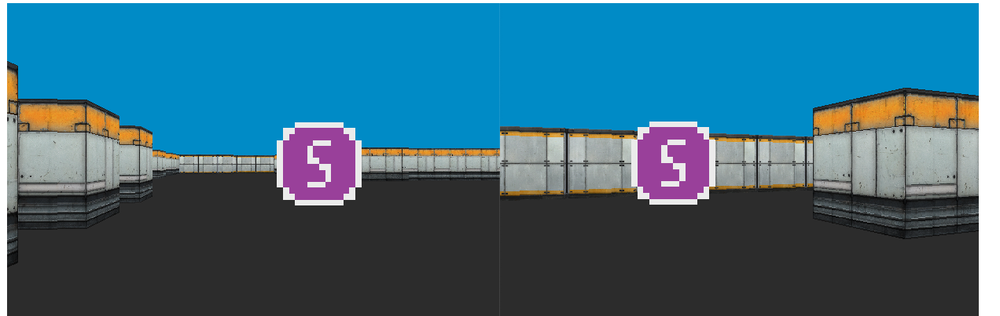

# Wolf Online

A simple networked raycaster made during University. Allows multiple clients to connect to the server and you can see each other move around.

Fairly basic but a good learning exercise to try out different coding styles, c++11 features, and networking. Includes some basic player smoothing.

## Building

Depends on SDL2 and SDL2_net.

Install on mac with `brew install sdl2 sdl2_net`.

Build with `make`

## Running

First launch the server, then you may launch multiple clients. Server and clients are fairly verbose when printing to stdout and stderr which should offer some insight into what they are doing.

Select a client window and move with `WASD` keys and the mouse.